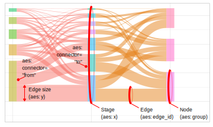
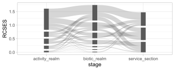

> `ggsankeyfier` Go with the data flow

## Overview

<!-- badges: start -->

[](https://github.com/pepijn-devries/csquares/actions/workflows/R-CMD-check.yaml)

[](https://CRAN.R-project.org/package=ggsankeyfier)
[](https://cran.r-project.org/web/checks/check_results_ggsankeyfier.html)
[](https://pepijn-devries.r-universe.dev/ggsankeyfier)
<!-- badges: end -->


The `ggsankeyfier` packages allows you to visualise your data as Sankey
or Alluvial diagrams. A Sankey diagram is essentially a stacked bar
plot, where the bands connect bars across stages (on the x-axis), to
show how quantities flow between them.

## Why use `ggsankeyfier`?

`ggsankeyfier` allows you to add Sankey diagram layers to a
`ggplot2::ggplot()`. The package also provides `stat_*` and `position_*`
functions that allow you to add all sorts of other layers, such as text
and labels.

Furthermore, the data model used by the package allows you to visualise
flows that skip stages or even feedback loops.

## Installation

> Get CRAN version

``` r
install.packages("ggsankeyfier")
```

> Get development version on github

``` r
devtools::install_github('pepijn-devries/ggsankeyfier')
```

## Important concepts

As there is some variation in the definition and terminology used in
Sankey diagrams, there are some introduced here for consistency across
the package documentation. Here we try to adhere to common definitions
used in the [graph theory](https://en.wikipedia.org/wiki/Graph_theory).
This theory is used to model pairwise relationships between ‘nodes’
which are connected by ‘edges’. These aspects are circled in the
illustration below.

<figure>

<figcaption aria-hidden="true">Important aspects</figcaption>
</figure>

The `ggsankeyfier` package can only visualise structured graphs. Meaning
that each node belongs to a specific stage (arranged along the x-axis).

### Sankey thesaurus

As there are no standards in Sankey diagrams, there may be different
words representing the same or similar aspects. Therefore the following
thesaurus is presented to provide an overview and hopefully avoid
confusion. The list starts with the term preferred in the present
package, followed by alternatives.

- Sankey diagram:
  - *Alluvial diagram*. Although arguably not the same as a Sankey
    diagram, they are very similar. Differences ly in the type of data
    (population of facts across categorical dimensions (alluvial) versus
    quantities in different states (Sankey)) Also, alluvial diagrams are
    always structured in stages (where the order does not matter),
    whereas Sankey diagrams are not necessarily structured, but the
    order does matter
    <!-- See also  http://www.datasmith.org/2020/05/02/alluvial-plots-vs-sankey-diagrams and
      https://datavizcatalogue.com/blog/sankey-diagrams-parallel-sets-alluvial-diagrams-whats-the-difference/ -->
  - *Bump diagram*. This is actually a special case of alluvial
    diagrams, where each node flows only to a single next node. Usually,
    the stacking order of nodes in each stage is determined by the size
    of the nodes
- Node:
  - *Vertices*. Another commonly used term in the [graph
    theory](https://en.wikipedia.org/wiki/Graph_theory)
  - *Stratum*. A term coined for alluvial diagrams
- Edge:
  - *Flow*. Sometimes also refers to the interaction between stages. In
    the present package it is used only as a synonym for ‘edge’.
  - *Alluvium*. A term used in alluvial diagrams
  - *Line*. Another commonly used albeit generic term in the [graph
    theory](https://en.wikipedia.org/wiki/Graph_theory)
  - *Link*. Although commonly used in the [graph
    theory](https://en.wikipedia.org/wiki/Graph_theory), we avoid its
    use in this context as it may get confused with a link in a
    cause-effect chain, which is better reflected by the stages
- Connector:
  - *Lode*. A term used in alluvial diagrams
- Stage:
  - *Link*. Not used in the present package to avoid confusion with
    edges (see above)

## Usage

Like any other ggplot, you start by calling `ggplot2::ggplot2()`,
provide the data for plotting and specify aesthetics (`aes`). Layers
with Sankey edges and nodes are simply added to the plot using the
`+`-operator:

``` r
data("ecosystem_services")

ggplot(ecosystem_services_pivot1,
       aes(x = stage, y = RCSES, group = node,
           connector = connector, edge_id = edge_id)) +
  geom_sankeyedge(v_space = "auto") +
  geom_sankeynode(v_space = "auto")
```

<!-- -->

For consistency with aesthetics used in other `ggplot2::ggplot()`
layers, the stage variable should be assigned to `x`, the quantity of
the nodes and edges to `y` and the node identifier to `group`. In
addition to these ‘standard’ aesthetics, you also need to specify a
`connector` specifying the direction of an edge (one of `'from'` or
`'to'`); and an `edge_id` which is used to determine which connector
ends should be paired together.

### Data management

Note that the plotting routines require data organised in a
`data.frame`, with in each row a ‘connector’. A connector is either the
start or an end of an edge. This allows you to provide different
characteristics for each of these ends. However, in most cases this is
not the type of data you will be working with. Check
`vignette("data_management")`, on how to rearrange your data for
displaying it in a Sankey diagram.

### Positioning nodes and edges

The package gives you much control on the positioning of elements in the
diagram. Think of:

- spacing between and sizing of nodes and edges
- aligning nodes vertically
- introducing a horizontal split in nodes
- stacking order of nodes and edges

`vignette("positioning")` will show you how.

### Decorating nodes and edges

When creating your own Sankey diagrams you may want to alter its
appearance. You may want to:

- assign meaningful decorations (such as colours) using aesthetics to
  nodes and edges
- add keys and legends to guide your audience
- add additional layers (such as text)
- change the edge curve shape
- use different themes

Check `vignette("decorating")` to discover how this is done.

## Code of Conduct

Please note that the `ggsankeyfier` project is released with a
[Contributor Code of
Conduct](https://contributor-covenant.org/version/2/1/CODE_OF_CONDUCT.html).
By contributing to this project, you agree to abide by its terms.

## Acknowledgements

This package was development as part of the EU GES4SEAS project (EU call
HORIZON-CL6-2021-BIODIV-01-04, grant agreement
[101059877](https://doi.org/10.3030/101059877)) and the WUR Knowledge
Base Research program KB-36-003-022 “The use of ecosystem services to
conserve biodiversity in the North Sea” that is supported by finance
from the Dutch Ministry of Agriculture, Nature and Food Quality

## Resources

- Piet GJ, Jongbloed RH, Bentley JW, Grundlehner A, Tamis JE, De Vries P
  (*in prep.*) A Cumulative Impact Assessment on the North Sea Capacity
  to Supply Ecosystem Services
  [DOI:10.2139/ssrn.4760674](http://dx.doi.org/10.2139/ssrn.4760674)
