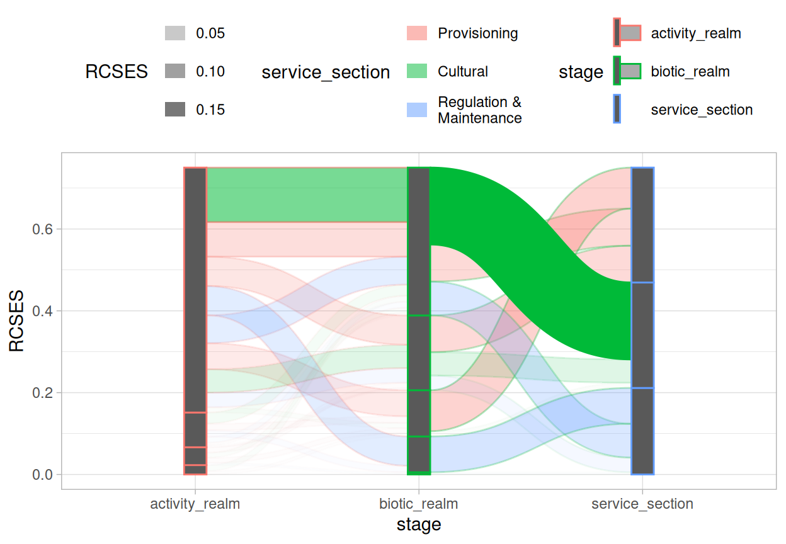
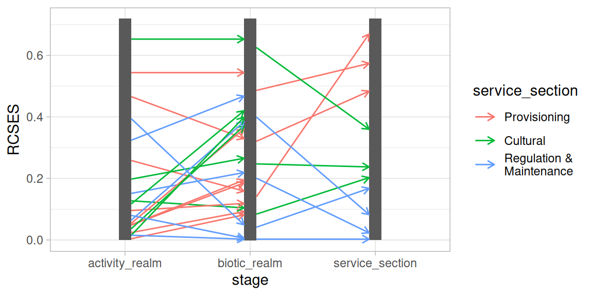
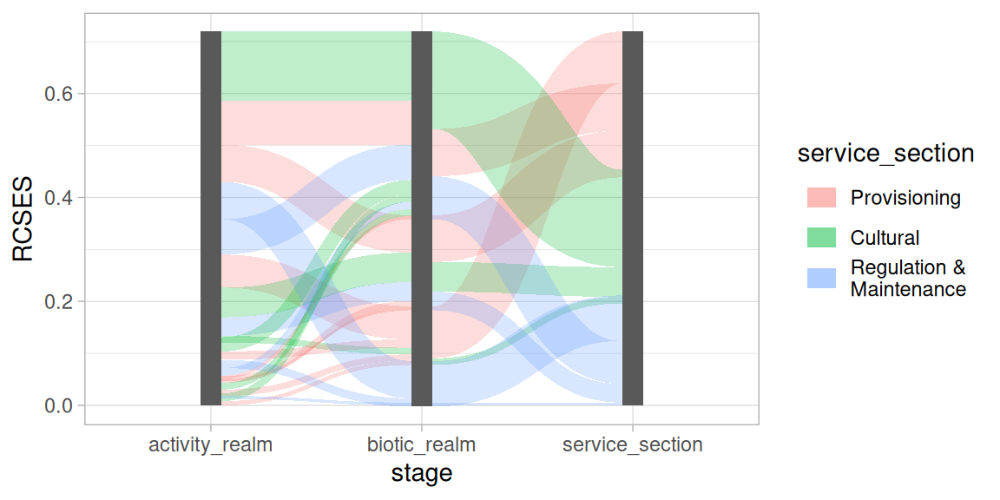
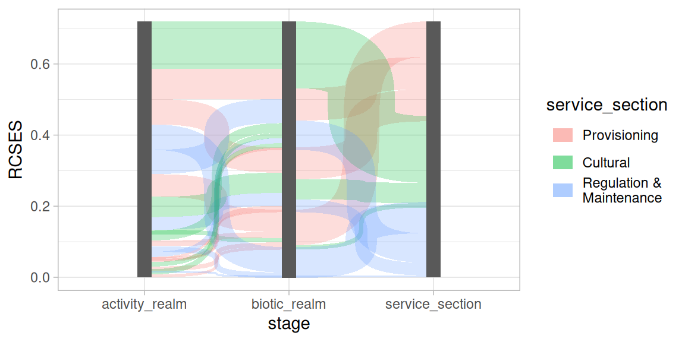
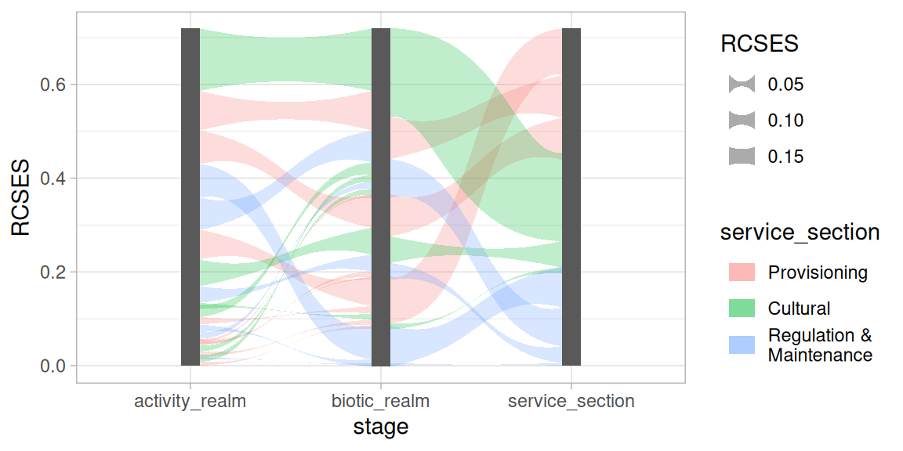
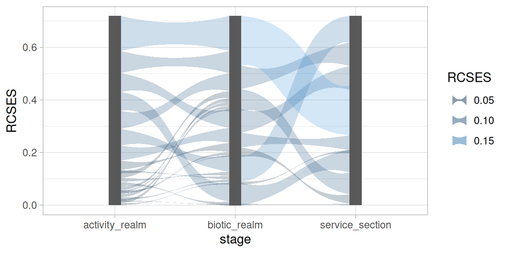
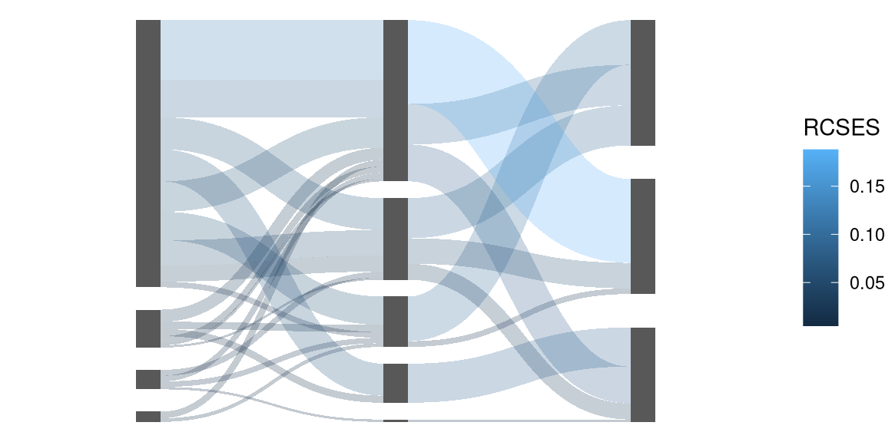
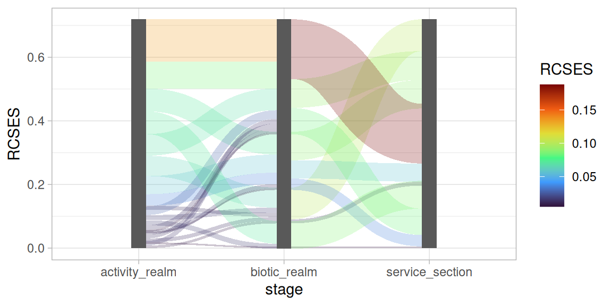

# Decorating Sankey diagrams

## Decorating nodes and edges with aesthetics

With the `waist` aesthetic you can modify the shape of the edge curve,
this is presented in more detail in the [Curve shape](#curve-shape)
section. Here it is shown how Nodes and edges can be decorated with the
`colour` (border of nodes and edges), `fill` (inside of nodes and
edges), and `alpha` aesthetics.

``` r
library(ggsankeyfier)
library(ggplot2)
theme_set(theme_light())
data("ecosystem_services")

## Let's subset the example data to create a less cluttered
## Sankey diagram
es_sub <-
  ecosystem_services |>
  subset(RCSES > 0.005) |>
  pivot_stages_longer(c("activity_realm", "biotic_realm", "service_section"),
                      "RCSES", "service_section")

ggplot(
  data    = es_sub,
  mapping = aes(x = stage, y = RCSES, group = node,
    edge_id = edge_id, connector = connector, colour = stage)) +
  ## apply fill and alpha aesthetic only to edges (not the nodes)
  geom_sankeyedge(aes(alpha = RCSES, fill = service_section)) +
  geom_sankeynode() +
  guides(fill   = guide_legend(ncol = 1),
         alpha  = guide_legend(ncol = 1),
         colour = guide_legend(ncol = 1)) +
  theme(legend.position = "top")
```



Note that both nodes and edges can be decorated separately. Also note
that each variable that is assigned to one or more aesthetics will get
its own guide legend. More about this in the section [Keys and
legends](#keys-and-legends).

## Additional layers

When you want to add additional layers to your plot (such as text
labels), it is important that those layers apply the same statistics and
positioning as the `geom_sankeyedge` or `geom_node` layers. To
illustrate we first need a base plot onto which the layers can be added:

``` r
pos <- position_sankey(v_space = "auto", order = "ascending", align = "justify")

p <-
  ggplot(
  data    = es_sub,
  mapping = aes(x = stage, y = RCSES, group = node,
    edge_id = edge_id, connector = connector))
```

When you want to add additional layers and you want to let them line up
with the nodes and edges, all you need to do is: use a consistent call
to
[`position_sankey()`](https://pepijn-devries.github.io/ggsankeyfier/reference/position_sankey.md)
for all layers; and add the
[`stat_sankeyedge()`](https://pepijn-devries.github.io/ggsankeyfier/reference/stat_sankey.md)
when you want to line up your layer with the edges in the sankey
diagram. This is shown in the example below where a
[`ggplot2::geom_segment()`](https://ggplot2.tidyverse.org/reference/geom_segment.html)
layer is added to the plot.

``` r
p +
  geom_sankeynode(position = pos) +
  geom_segment(aes(col = service_section),
               position = pos, stat = "sankeyedge",
               arrow = arrow(length = unit(0.2, "cm")))
```



When you want to align your layer with the nodes in a diagram, you need
to add
[`stat_sankeynode()`](https://pepijn-devries.github.io/ggsankeyfier/reference/stat_sankey.md)
to your layer. Below a
[`ggplot2::geom_bar()`](https://ggplot2.tidyverse.org/reference/geom_bar.html)
layer is added to the plot, which appears as a normal
[`geom_sankeynode()`](https://pepijn-devries.github.io/ggsankeyfier/reference/geom_sankeynode.md)
layer. This is because they are very similar but mostly just differ in
the positioning and stats that are applied.

``` r
p +
  geom_sankeyedge(aes(fill = service_section), position = pos) +
  geom_bar(position = pos, stat = "sankeynode")
```



## Curve shape

The curves that connect the nodes in `ggsankeyfier` are drawn as
symmetrical widened
[Bézier](https://en.wikipedia.org/wiki/B%C3%A9zier_curve) curves. The
slope of the curve can be controlled with the `slope` parameter. The
curve becomes very steep when `slope = 1`:

``` r
p +
  geom_sankeyedge(slope = 1, position = pos, mapping = aes(fill = service_section)) +
  geom_sankeynode(position = pos)
```



You could even go beyond the `slope` of 1, but then the curve will start
to zigzag. With values less than 1 will result in gentler slopes.

We can also play with how much the curve is widened. By default the
width of the curve is constant along the Bézier curve it follows. By
setting the `waist` aesthetic, the width of the curve is blown up, or
shrunk down at its center. There are also `scale_waist_*` functions
(like
[`scale_waist_continuous()`](https://pepijn-devries.github.io/ggsankeyfier/reference/scale_waist.md)),
which allow you to adjust the appearance of the waist and its legend
keys.

``` r
p +
  geom_sankeyedge(aes(waist = RCSES, fill = service_section), position = pos) +
  geom_sankeynode(position = pos)
```



## Keys and legends

Both nodes and edges have their own `draw_key()` function, meaning that
they are drawn automatically by
[`ggplot2::guide_legend()`](https://ggplot2.tidyverse.org/reference/guide_legend.html).
When multiple aesthetics are based on the same variable, they are
combined in a single legend (where possible). In order to make this
work, you will use the same guide (`"legend"` in case of the example
below) for both scales.

``` r
p +
  geom_sankeyedge(aes(waist = RCSES, fill = RCSES), position = pos) +
  geom_sankeynode(position = pos) +
  scale_waist_binned(guide = "legend") +
  scale_fill_binned(guide = "legend")
```



## Different themes

At the top of this vignette we set
[`ggplot2::theme_light()`](https://ggplot2.tidyverse.org/reference/ggtheme.html)
as the default theme. It is also possible to add themes directly to the
plot:

``` r
p +
  geom_sankeyedge(aes(fill = RCSES), position = pos) +
  geom_sankeynode(position = pos) +
  theme_void()
```



To change the colour scheme of the coloured aesthetics, you need to add
the appropriate colour scale. Let’s add some turbo colours to our
diagram:

``` r
p +
  geom_sankeyedge(aes(fill = RCSES), position = pos) +
  geom_sankeynode(position = pos) +
  scale_fill_viridis_c(option = "turbo")
```


