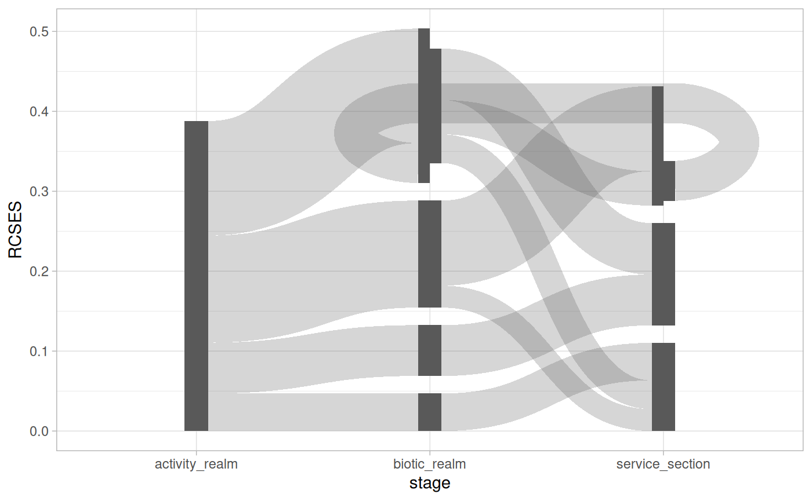
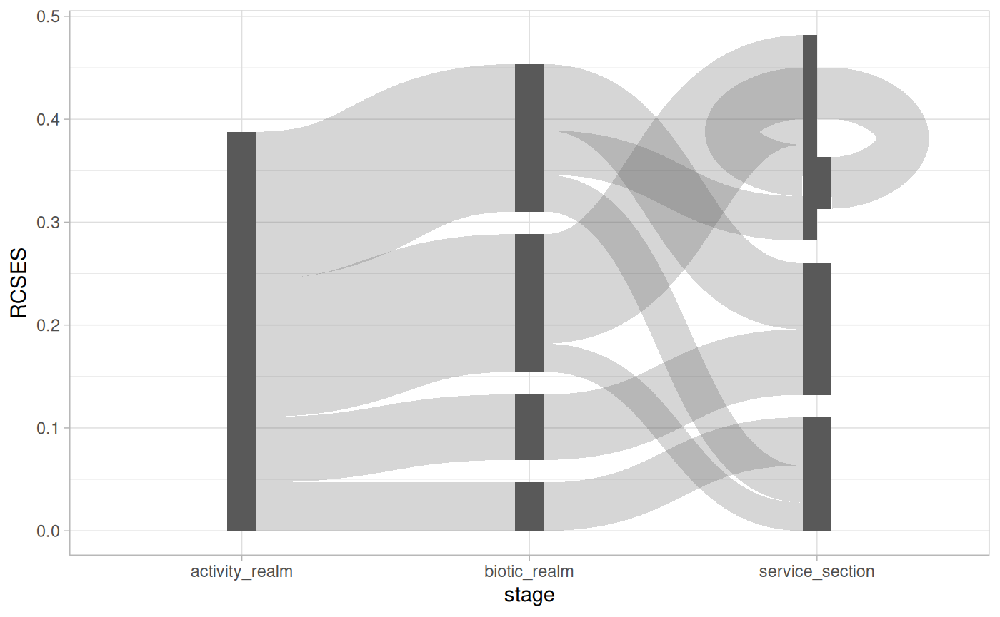

# Loop De Loop

## To cycle or not to cycle

The `ggsankeyfier` package requires you to specify from which node, to
which node an edge flows. See
[`vignette("data_management")`](https://pepijn-devries.github.io/ggsankeyfier/articles/data_management.md)
for more technical details on how this works. Consequently, this allows
you to let edges flow to any node in any stage. In most cases, Sankey or
alluvial diagrams are essentially stage-structured [directed acyclic
graphs](https://en.wikipedia.org/wiki/Directed_acyclic_graph). However,
the way that `ggsankeyfier` organises data allows you to create
stage-structured [directed
graphs](https://en.wikipedia.org/wiki/Directed_graph). In other words,
you can create feedback loops in your diagram. This is demonstrated in
the present vignette.

For the examples we first need to prepare a basic plot:

``` r
library(ggsankeyfier)
library(ggplot2)
theme_set(theme_light())
set.seed(0)

pos <- position_sankey(v_space = "auto")

## Let's subset the data, to make the plot less cluttered:
es_subset <- pivot_stages_longer(
  subset(ecosystem_services, RCSES > 0.02),
  c("activity_realm", "biotic_realm", "service_section"),
  "RCSES")

# And prepare a basis for the plot
p <-
  ggplot(es_subset, aes(x = stage, y = RCSES, group = node,
                        connector = connector, edge_id = edge_id)) +
  geom_sankeynode(position = pos) +
  geom_sankeyedge(position = pos)
```

## Feedback

In order to demonstrate a feedback loop we `rbind` a fictional edge to
the demonstration data. Note that this feedback loop does not make any
sense in the context of the data. It only serves as proof of principle.
With the `%+%` operator we update the plot with the data that includes
the feedback loop.

``` r
es_subset_feedback <-
  es_subset |>
  rbind(
    data.frame(
      RCSES     = 0.05,
      edge_id   = max(es_subset$edge_id) + 1,
      connector = c("from", "to"),
      node      = c("Cultural", "Fish & Cephalopods"),
      stage     = c("service_section", "biotic_realm")
    )
  )

p %+% es_subset_feedback
#> Warning: <ggplot> %+% x was deprecated in ggplot2 4.0.0.
#> ℹ Please use <ggplot> + x instead.
#> This warning is displayed once every 8 hours.
#> Call `lifecycle::last_lifecycle_warnings()` to see where this warning was
#> generated.
```



## Self reference

Edges don’t even have to flow from one stage to another regardless of
its direction. Instead, it is also possible to let an edge flow from and
to the same stage. In fact, you can even let an edge flow from and to
the same node. This is illustrated in the example below, we we `rbind` a
fictional self-referencing node. Again, in the context of the data, this
self-reference does not make sense, but it serves as proof of principle.

``` r
es_subset_selfref <-
  es_subset |>
  rbind(
    data.frame(
      RCSES     = 0.05,
      edge_id   = max(es_subset$edge_id) + 1,
      connector = c("from", "to"),
      node      = c("Cultural", "Cultural"),
      stage     = c("service_section", "service_section")
    )
  )

p %+% es_subset_selfref
```


