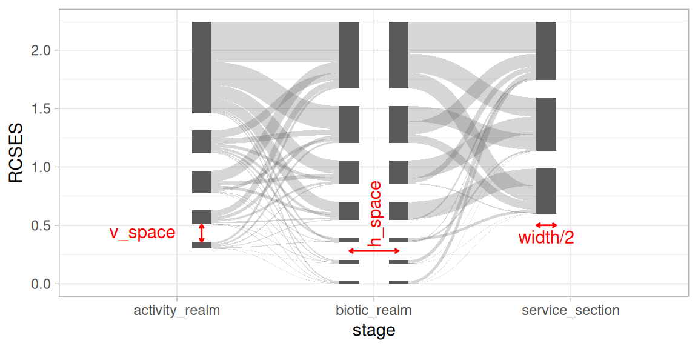
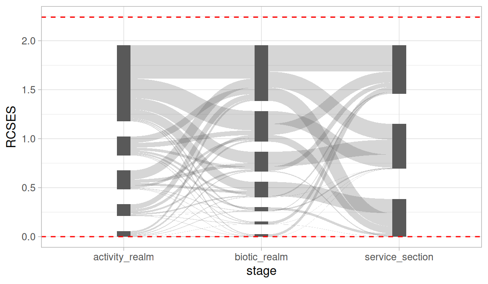
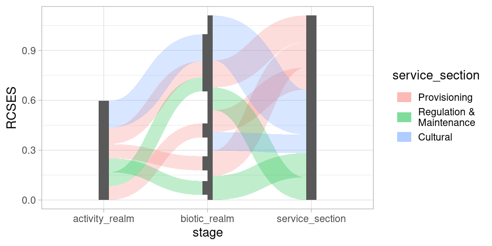
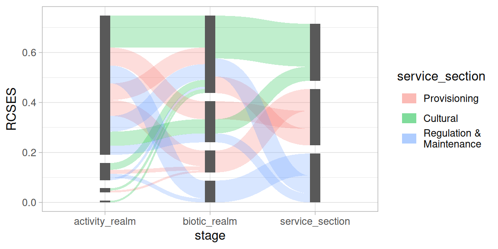
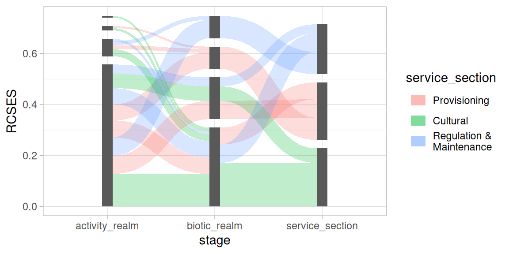
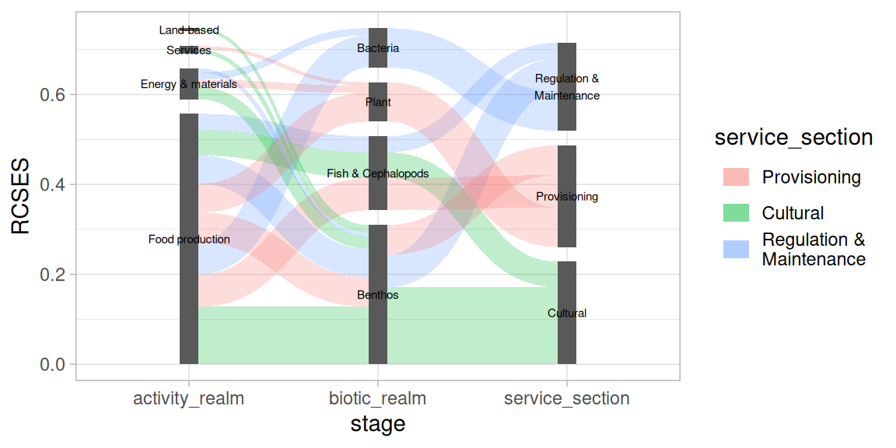
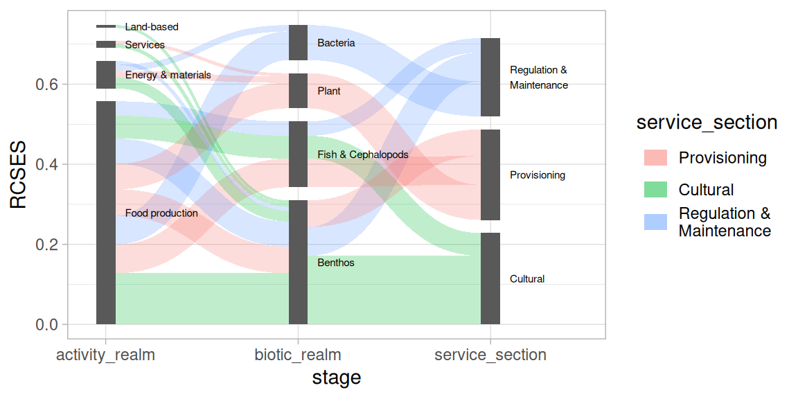

# Positioning Sankey elements

## Using `position_sankey`

Positioning elements in a Sankey / alluvial diagram is controlled with
the
[`position_sankey()`](https://pepijn-devries.github.io/ggsankeyfier/reference/position_sankey.md)
function. It can be used to set spacing between nodes (see
[Spacing](#spacing)); Apply vertical alignment (see
[Alignment](#alignment)); Introduce a split within a stage (see
[Splitting nodes](#splitting-nodes)); Alter the stacking order (see
[Stacking order](#stacking-order)); Nudge positions (see
[Nudging](#nudging)).

In order to illustrate the positioning options,
[`?ecosystem_services`](https://pepijn-devries.github.io/ggsankeyfier/reference/ecosystem_services.md)
data is used which comes packaged with `ggsankeyfier`.

``` r
library(ggplot2)
library(ggsankeyfier)
theme_set(theme_light())
data("ecosystem_services")
```

Please check
[`vignette("data_management")`](https://pepijn-devries.github.io/ggsankeyfier/articles/data_management.md)
if you wish to understand how this data was pre-processed.

## Spacing

There are three important parameters when setting up the spacing in a
Sankey diagram:

- `width`: which specifies the combined width of a node in a specific
  stage. When the nodes are split up, each half will have a width of
  `width / 2`.
- `h_space`: is the horizontal space (specified in native units) between
  split nodes (measured from the center of each half).
- `v_space`: is the minimal vertical space between nodes measured in
  native units. Depending on the alignment of nodes this spacing might
  be stretched.

This is illustrated in the following example:

``` r
pos <- position_sankey(split_nodes = TRUE, align = "top",
                       width = 0.2, v_space = 0.15, h_space = 0.25)
serv_plot <-
  ggplot(ecosystem_services_pivot1,
         aes(x = stage, y = RCSES, group = node, connector = connector,
             edge_id = edge_id)) +
  geom_sankeyedge(position = pos) +
  geom_sankeynode(position = pos)
```



## Alignment

Vertical alignment can be controlled with the `align` argument.
Alignment is explained with the plot shown below. There, two red
horizontal dashed guide lines are used to snap the different alignment
options.



When `align = 'justified'`, nodes in each stage are spread (by varying
the vertical space) such that they line up with the top and bottom guide
lines. The minimum space between nodes is controlled with `v_space`.

When `align = 'top'` or `'bottom'`, nodes are aligned with the top or
bottom guide line respectively, where the `v_space` will be constant.

When `align = 'center'`, nodes are centered around the middle between
the top and bottom guide lines, where `v_space` will be constant.

When you are working with `split_nodes = TRUE`, alignment will be a more
tedious job.

## Splitting nodes

When `split_nodes = TRUE`, a vertical split is introduced for each node
in a stage. This split can be useful when you wish to emphasise
transitions between stages. It can also be used to show an imbalance
when edges flowing from and to nodes are not equal. This imbalance is
shown in the example below, by selecting a subset of edges. Note that a
split is introduced automatically when edges flowing from and to a node
are not equal.

``` r
es_sub <- ecosystem_services_pivot2 |> subset(RCSES > quantile(RCSES, 0.9))
ggplot(es_sub,
       aes(x = stage, y = RCSES, group = node, connector = connector, edge_id = edge_id)) +
  geom_sankeyedge(aes(fill = service_section)) +
  geom_sankeynode()
```



## Stacking order

Another aspect you might want to control in a Sankey diagram is the
stacking order of the nodes and edges. When `order = "as_is"`, the nodes
will be stacked in the order of their levels (or order of appearance),
the edges will be arranged in the order of `edge_id` (or their order of
appearance). Other options are `order = "ascending"` and
`order = "descending"`, both of which are based on the `y` aesthetic.

In order to demonstrate the stacking order we reduce the number of
records from the example data (i.e., only select the higher risk chains
from the data). This will produce a less cluttered Sankey diagram.

``` r
es_sub <-
  ecosystem_services |>
  subset(RCSES > quantile(RCSES, 0.99)) |>
  pivot_stages_longer(c("activity_realm", "biotic_realm", "service_section"),
                      "RCSES", "service_section")

p <- ggplot(es_sub,
       aes(x = stage, y = RCSES, group = node, connector = connector,
           edge_id = edge_id))
```

This will plot the nodes and edges in ascending stacking order (largest
at the top):

``` r
pos <- position_sankey(v_space = "auto", order = "ascending")
p + geom_sankeyedge(aes(fill = service_section), position = pos) +
  geom_sankeynode(position = pos)
```



This will plot the nodes and edges in desacending stacking order
(largest at the bottom):

``` r
pos <- position_sankey(v_space = "auto", order = "descending")
p + geom_sankeyedge(aes(fill = service_section), position = pos) +
  geom_sankeynode(position = pos)
```



## Nudging

The function
[`position_sankey()`](https://pepijn-devries.github.io/ggsankeyfier/reference/position_sankey.md)
can also be used to position text labels. Let’s use it to add labels to
the nodes. Note that we are using a simple
[`ggplot2::geom_text()`](https://ggplot2.tidyverse.org/reference/geom_text.html)
layer, where we provide `"sankeynode"` as `stat` function and the `pos`
object for positioning the labels.

``` r
pos <- position_sankey(v_space = "auto", order = "descending")
p + geom_sankeyedge(aes(fill = service_section), position = pos) +
  geom_sankeynode(position = pos) +
  geom_text(aes(label = node), stat = "sankeynode", position = pos, cex = 2)
```



Let’s say you want to place the text labels next to the nodes. In that
case you need to *nudge* the calculated into the desired position. We
also need to adjust the justification of the text labels and expand the
x scales.

``` r
pos_text <- position_sankey(v_space = "auto", order = "descending", nudge_x = 0.1)
p + geom_sankeyedge(aes(fill = service_section), position = pos) +
  geom_sankeynode(position = pos) +
  geom_text(aes(label = node), stat = "sankeynode", position = pos_text, hjust = 0, cex = 2) +
  scale_x_discrete(expand = expansion(add = c(0.2, .6)))
```


