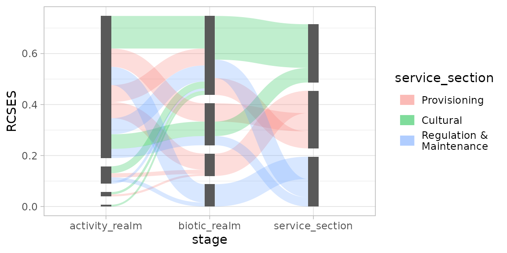
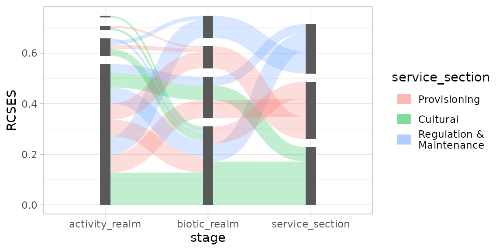
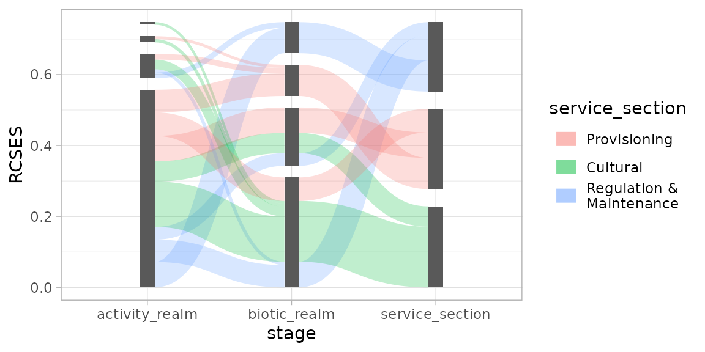
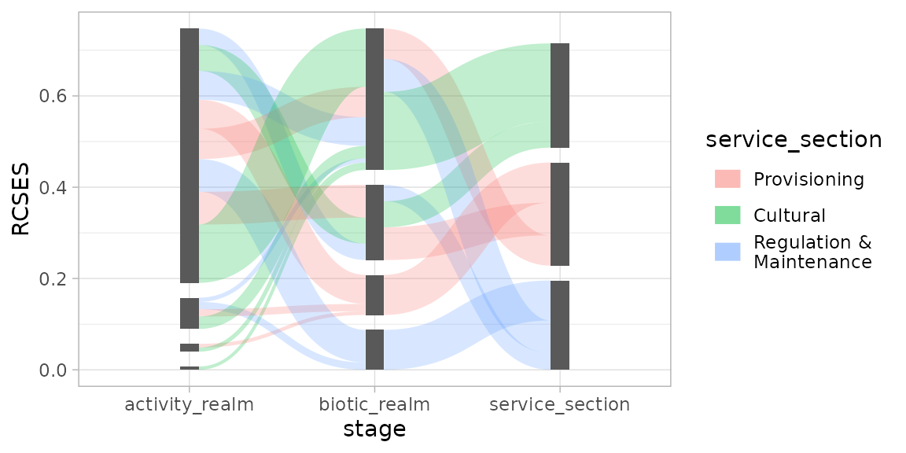

# Stacking Order

## Small to Large (or Vice Versa)

Let’s start by setting up a simple plot to demonstrate stacking order
options:

``` r
library(ggsankeyfier)
library(ggplot2)

## Let's start with subsetting the data to make it less cluttered
es_sub <-
  ecosystem_services |>
  subset(RCSES > quantile(RCSES, 0.99)) |>
  pivot_stages_longer(c("activity_realm", "biotic_realm", "service_section"),
                      "RCSES", "service_section")

p <- ggplot(es_sub,
              aes(x = stage, y = RCSES, group = node, connector = connector,
                  edge_id = edge_id))
```

Using
[`position_sankey()`](https://pepijn-devries.github.io/ggsankeyfier/reference/position_sankey.md),
a stacking order can be specified. Let’s start by demonstrating the
ascending order (largest at the top):

``` r
pos <- position_sankey(v_space = "auto", order = "ascending")
p + geom_sankeyedge(aes(fill = service_section), position = pos) +
  geom_sankeynode(position = pos)
```



This will plot the nodes and edges in descending stacking order (largest
at the bottom):

``` r
pos <- position_sankey(v_space = "auto", order = "descending")
p + geom_sankeyedge(aes(fill = service_section), position = pos) +
  geom_sankeynode(position = pos)
```



## More Order Please

Even though the nodes and edges are sorted by their size in the plot
above, it is still hard to read, as the coloured flow going to specific
ecosystem components can end up anywhere and don’t align for incoming
and outgoing edges. This is where order options `ascending+` and
`descending+` come in handy. Before sorting the edges by size, it will
first arrange them by its aesthetics (in case of this example, the
`fill` colour). Like so:

``` r
pos <- position_sankey(order = "descending+", v_space = "auto", align = "justify")

p + geom_sankeyedge(aes(fill = service_section), position = pos) +
  geom_sankeynode(position = pos)
```



As you will notice, the edges with the same fill colour now line up.

## Give me the Power

If all of this isn’t enough, you can write your own ordering function,
giving you full power over the stacking order of edges and nodes. This
function should accept 1 argument: `data`.
[`position_sankey()`](https://pepijn-devries.github.io/ggsankeyfier/reference/position_sankey.md)
will call this function with a `data.frame` containing either
information about nodes, or edges. Your custom function should return
the same `data.frame`, with extra information for the ordering. In case
of nodes, the function should add a column named `node_order`, in case
of edges, two columns need to be added: `edge_order` for outgoing flows,
and `edge_order_end` for incoming flows.

The example below shows how you can write such a function and how it
affects your plot.

``` r
## Definition of a custom ordering function:
custom_order <- function(data) {
  
  if ("edge_id" %in% names(data)) { # data contains edge info
    
    ## Order incoming edges from big to small
    data$edge_order_end <- data$y
    ## Order outgoing edges from small to big (note minus sign)
    data$edge_order <- -data$y
    
  } else { ## data contains node info
    
    data$node_order <- data$y
    
  }
  return(data)
}

pos <- position_sankey(v_space = "auto", order = custom_order)

p + geom_sankeyedge(aes(fill = service_section), position = pos) +
  geom_sankeynode(position = pos)
```


