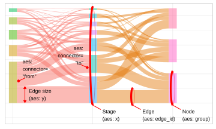

# Sankey edges (flows)

`geom_sankeysegment()` draws a straight line between two connected
nodes, `geom_sankeyedge()` draws a ribbon between nodes following a
Bezier curved path. If you combine the edges with
[`geom_sankeynode()`](https://pepijn-devries.github.io/ggsankeyfier/reference/geom_sankeynode.md),
make sure that both use the same `position` object.

## Usage

``` r
GeomSankeysegment

geom_sankeysegment(
  mapping = NULL,
  data = NULL,
  stat = "sankeyedge",
  position = "sankey",
  na.rm = FALSE,
  show.legend = NA,
  order = c("ascending", "descending", "ascending+", "descending+", "as_is"),
  width = "auto",
  align = c("bottom", "top", "center", "justify"),
  h_space = "auto",
  v_space = 0,
  nudge_x = 0,
  nudge_y = 0,
  split_nodes = FALSE,
  split_tol = 0.001,
  direction = c("forward", "backward"),
  inherit.aes = TRUE,
  ...
)

GeomSankeyedge

geom_sankeyedge(
  mapping = NULL,
  data = NULL,
  stat = "sankeyedge",
  position = "sankey",
  na.rm = FALSE,
  show.legend = NA,
  slope = 0.5,
  curve_weight = 0.5,
  ncp = 100,
  width = "auto",
  align = c("bottom", "top", "center", "justify"),
  order = c("ascending", "descending", "ascending+", "descending+", "as_is"),
  h_space = "auto",
  v_space = 0,
  nudge_x = 0,
  nudge_y = 0,
  split_nodes = FALSE,
  split_tol = 0.001,
  direction = c("forward", "backward"),
  inherit.aes = TRUE,
  ...
)
```

## Format

An object of class `GeomSankeysegment` (inherits from `GeomSegment`,
`Geom`, `ggproto`, `gg`) of length 4.

An object of class `GeomSankeyedge` (inherits from `GeomSankeysegment`,
`GeomSegment`, `Geom`, `ggproto`, `gg`) of length 7.

## Arguments

- mapping:

  Set of aesthetic mappings created by
  [`aes()`](https://ggplot2.tidyverse.org/reference/aes.html). If
  specified and `inherit.aes = TRUE` (the default), it is combined with
  the default mapping at the top level of the plot. You must supply
  `mapping` if there is no plot mapping.

- data:

  The data to be displayed in this layer. There are three options:

  If `NULL`, the default, the data is inherited from the plot data as
  specified in the call to
  [`ggplot()`](https://ggplot2.tidyverse.org/reference/ggplot.html).

  A `data.frame`, or other object, will override the plot data. All
  objects will be fortified to produce a data frame. See
  [`fortify()`](https://ggplot2.tidyverse.org/reference/fortify.html)
  for which variables will be created.

  A `function` will be called with a single argument, the plot data. The
  return value must be a `data.frame`, and will be used as the layer
  data. A `function` can be created from a `formula` (e.g.
  `~ head(.x, 10)`).

- stat:

  The statistical transformation to use on the data for this layer. When
  using a `geom_*()` function to construct a layer, the `stat` argument
  can be used to override the default coupling between geoms and stats.
  The `stat` argument accepts the following:

  - A `Stat` ggproto subclass, for example `StatCount`.

  - A string naming the stat. To give the stat as a string, strip the
    function name of the `stat_` prefix. For example, to use
    [`stat_count()`](https://ggplot2.tidyverse.org/reference/geom_bar.html),
    give the stat as `"count"`.

  - For more information and other ways to specify the stat, see the
    [layer
    stat](https://ggplot2.tidyverse.org/reference/layer_stats.html)
    documentation.

- position:

  A position adjustment to use on the data for this layer. This can be
  used in various ways, including to prevent overplotting and improving
  the display. The `position` argument accepts the following:

  - The result of calling a position function, such as
    [`position_jitter()`](https://ggplot2.tidyverse.org/reference/position_jitter.html).
    This method allows for passing extra arguments to the position.

  - A string naming the position adjustment. To give the position as a
    string, strip the function name of the `position_` prefix. For
    example, to use
    [`position_jitter()`](https://ggplot2.tidyverse.org/reference/position_jitter.html),
    give the position as `"jitter"`.

  - For more information and other ways to specify the position, see the
    [layer
    position](https://ggplot2.tidyverse.org/reference/layer_positions.html)
    documentation.

- na.rm:

  If `FALSE`, the default, missing values are removed with a warning. If
  `TRUE`, missing values are silently removed.

- show.legend:

  logical. Should this layer be included in the legends? `NA`, the
  default, includes if any aesthetics are mapped. `FALSE` never
  includes, and `TRUE` always includes. It can also be a named logical
  vector to finely select the aesthetics to display. To include legend
  keys for all levels, even when no data exists, use `TRUE`. If `NA`,
  all levels are shown in legend, but unobserved levels are omitted.

- order:

  A `character` indicating the method to be used for the order of
  stacking nodes and edges in a plot. Should be one of: `ascending`
  (default), sorts nodes and edges from large to small (largest on top);
  `descending` sorts nodes and edges from small to large (smallest on
  top); `ascending+` Same as `ascending` but it also arranges edges and
  nodes by its aesthetics; `descending+` Same as `descending` but it
  also arranges edges/nodes by its aesthetics; `as_is` will leave the
  order of nodes and edges as they are in `data`.

  You can also provide a custom function to control the stacking order
  of nodes and edges. The function needs to accept one argument (`data`)
  which can be either nodes or edges data. The function needs to add a
  column named `node_order` containing numbers by which the nodes need
  to be ordered. In case of edges you need to add two columns. One named
  `edge_order`, controlling the order of outgoing edges, and one named
  `edge_order_end` controlling the order of incoming edges. For more
  details see
  [`vignette("stacking_order")`](https://pepijn-devries.github.io/ggsankeyfier/articles/stacking_order.md).

- width:

  Width of the node (`numeric`). When `split_nodes` is set to `TRUE`
  each part of the split node will have half this width. Use `"auto"` to
  automatically determine a suitable width.

- align:

  A `character` that indicates how the nodes across the stages are
  aligned. It can be any of `"top"`, `"bottom"`, `"center"` or
  `"justify"`.

- h_space:

  Horizontal space between split nodes (`numeric`). This argument is
  ignored when `split_nodes == FALSE`. Use `"auto"` to automatically
  position split nodes.

- v_space:

  Vertical space between nodes (`numeric`). When set to zero (`0`), the
  Sankey diagram becomes an alluvial plot. Use `"auto"` to automatically
  determine a suitable vertical space.

- nudge_x, nudge_y:

  Horizontal and vertical adjustment to nudge items by. Can be useful
  for offsetting labels.

- split_nodes:

  A `logical` value indicating whether the source and destination nodes
  should be depicted as separate boxes.

- split_tol:

  When the relative node size (resulting source and destination edges)
  differs more than this fraction, the node will be displayed as two
  separate bars.

- direction:

  One of `"forward"` (default) or `"backward"`. When set to `"backward"`
  the direction of the edges will be inverted. In most cases this
  parameter won't affect the plot. It can be helpful when you want to
  decorate the end of an edge (instead of the start; see examples).

- inherit.aes:

  If `FALSE`, overrides the default aesthetics, rather than combining
  with them. This is most useful for helper functions that define both
  data and aesthetics and shouldn't inherit behaviour from the default
  plot specification, e.g.
  [`annotation_borders()`](https://ggplot2.tidyverse.org/reference/annotation_borders.html).

- ...:

  Other arguments passed on to
  [`layer()`](https://ggplot2.tidyverse.org/reference/layer.html)'s
  `params` argument. These arguments broadly fall into one of 4
  categories below. Notably, further arguments to the `position`
  argument, or aesthetics that are required can *not* be passed through
  `...`. Unknown arguments that are not part of the 4 categories below
  are ignored.

  - Static aesthetics that are not mapped to a scale, but are at a fixed
    value and apply to the layer as a whole. For example,
    `colour = "red"` or `linewidth = 3`. The geom's documentation has an
    **Aesthetics** section that lists the available options. The
    'required' aesthetics cannot be passed on to the `params`. Please
    note that while passing unmapped aesthetics as vectors is
    technically possible, the order and required length is not
    guaranteed to be parallel to the input data.

  - When constructing a layer using a `stat_*()` function, the `...`
    argument can be used to pass on parameters to the `geom` part of the
    layer. An example of this is
    `stat_density(geom = "area", outline.type = "both")`. The geom's
    documentation lists which parameters it can accept.

  - Inversely, when constructing a layer using a `geom_*()` function,
    the `...` argument can be used to pass on parameters to the `stat`
    part of the layer. An example of this is
    `geom_area(stat = "density", adjust = 0.5)`. The stat's
    documentation lists which parameters it can accept.

  - The `key_glyph` argument of
    [`layer()`](https://ggplot2.tidyverse.org/reference/layer.html) may
    also be passed on through `...`. This can be one of the functions
    described as [key
    glyphs](https://ggplot2.tidyverse.org/reference/draw_key.html), to
    change the display of the layer in the legend.

- slope:

  Slope parameter (`numeric`) for the Bezier curves used to depict the
  edges. Any value between 0 and 1 will work nicely. Other non-zero
  values will also work.

- curve_weight:

  Places weight on the Bezier curve. Values close to zero will pull the
  inflection point of the curve towards outgoing nodes. Values close to
  one will pull them towards incoming nodes. The default is 0.5, which
  will place the inflection point exactly in the middle of the
  connecting nodes.

- ncp:

  Number of control points on the Bezier curve that forms the edge.
  Larger numbers will result in smoother curves, but cost more
  computational time. Default is 100.

## Value

Returns a
[`ggplot2::layer()`](https://ggplot2.tidyverse.org/reference/layer.html)
which can be added to a
[`ggplot2::ggplot()`](https://ggplot2.tidyverse.org/reference/ggplot.html)

## Details

This `ggplot2` layer connects between paired nodes via a Bezier curve.
The width of the curve is determined by its `y` aesthetic. It will be
attempted to keep the width of the curve constant along its curved path,
for the targeted graphics device. When the aspect ratio of the graphics
device is altered after the plot is generated, the aspect ratio maybe
off. In that case render the plot again.

## Aesthetics

`geom_sankeysegment()` and `geom_sankeyedge()` understand the following
aesthetics (required aesthetics are in bold)



- **`x`**: Works for variables on a discrete scale. Might work for
  continuous variables but is not guaranteed. This variable is used to
  distinguish between stages in the Sankey diagram on the x axis.

- **`y`**: A continuous variable representing the width of the edges in
  a Sankey diagram.

- **`group`**: A discrete variable used for grouping edges to nodes in
  each stage. Essentially it is an identifier for the nodes.

- **`connector`**: Indicates which side of an edge is reflected by the
  corresponding record. Should be one of `"from"` or `"to"`.

- **`edge_id`**: A unique identifier value for each edge. This
  identifier is used to link specific `"from"` and `"to"` records in an
  edge (flow).

- fill: see
  [`vignette("ggplot2-specs", "ggplot2")`](https://ggplot2.tidyverse.org/articles/ggplot2-specs.html)

- colour: see
  [`vignette("ggplot2-specs", "ggplot2")`](https://ggplot2.tidyverse.org/articles/ggplot2-specs.html)

- linetype: see
  [`vignette("ggplot2-specs", "ggplot2")`](https://ggplot2.tidyverse.org/articles/ggplot2-specs.html)

- linewidth: see
  [`vignette("ggplot2-specs", "ggplot2")`](https://ggplot2.tidyverse.org/articles/ggplot2-specs.html)

- alpha: A variable to control the opacity of an element.

&nbsp;

- waist: A variable to control the width of an edge in between two
  nodes. Small values will create a hour glass shape, whereas large
  values will produce an apple shape.

## Author

Pepijn de Vries

## Examples

``` r
library(ggplot2)
data("ecosystem_services")

ggplot(ecosystem_services_pivot1, aes(x = stage, y = RCSES, group = node,
                    connector = connector, edge_id = edge_id,
                    fill = node)) +
  geom_sankeynode(v_space = "auto") +
  geom_sankeyedge(v_space = "auto")
```
